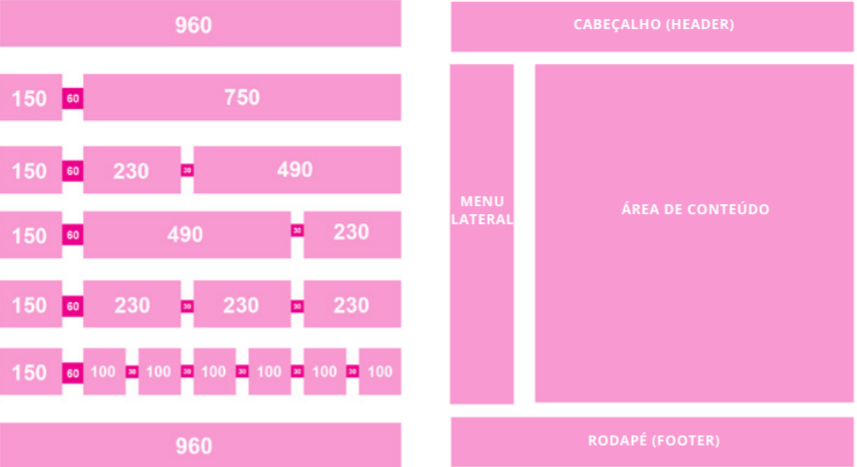

# 1. Introdução
## 1.1. Objetivo

O guia de estilo é um registro das principais decisões de design tomadas, 
para que elas não se percam durante o desenvolvimento do produto e sejam 
incorporadas no projeto final. Ele tem como principal objetivo servir de 
ferramenta de comunicação entre os membros da equipe de design e de 
desenvolvimento.

## 1.2 Considerações

Este guia de estilo foi produzido seguindo o modelo de Marcus (1991), que 
considera os seguintes elementos como essenciais: 

- layout: proporção e grids; uso de metáforas espaciais; design gráfico de exibidores e ferramentas; 
- tipografia e seu uso em diálogos, formulários e relatórios;
- simbolismo: clareza e consistência no design de ícones;
- cores: os dez mandamentos sobre o uso de cores;
- visualização de informação: design de gráficos, diagramas e mapas;
- design de telas e elementos de interface (widgets).

Considerando que o site analisado (Prefeitura de João Pessoa) é um portal institucional,
o site deve seguir os padrões do "Guia de Estilo do Portal Institucional Padrão". Então 
a sua análise também foi feita levando em consideração os padrões deste guia.

# 2. Resultados da análise
## 2.1. Disposição espacial e grid

A disposição do site, como vista na figura 1, é formada principalmente pelo cabeçalho, 
menu lateral, área de conteúdo e rodapé, seguindo o esquema do "Guia de Estilo do Portal Institucional Padrão" (Figura 2).

 Figura 1 - Disposição do site da Prefeitura de João Pessoa

 Fonte: https://www.joaopessoa.pb.gov.br

 Figura 2 - Grid do Guia de Estilo do Portal Institucional Padrão

 Fonte: https://www.gov.br/gestaodeconteudo/pt-br/arquivos/guia-de-estilo-identidade-padrao-comunicacao.pdf

## 2.2. Tipografia

O site utiliza principalmente uma única fonte, a Segoe UI, que é derivada da fonte 
Open Sans, recomendada pelo "Guia de Estilo do Portal Institucional Padrão", como pode ser visto na figura 3.

 Figura 3 - Fontes recomendadas pelo Guia de Estilo do Portal Institucional Padrão

 Fonte: https://www.gov.br/gestaodeconteudo/pt-br/arquivos/guia-de-estilo-identidade-padrao-comunicacao.pdf

## 2.3. Ícones e Símbolos

São utilizados diversos simbolos e icones no site para guiar o usuário entre as telas e outras mídias.
Como exemplificado na figura 4 a seguir.
O "Guia de Estilo do Portal Institucional Padrão" também recomenda alguns icones, como visto na figura 5.

 Figura 4 - Ícones e Símbolos do site da Prefeitura de João Pessoa

 Fonte: https://www.joaopessoa.pb.gov.br

 Figura 5 - Ícones e Símbolos recomendados pelo Guia de Estilo do Portal Institucional Padrão

 Fonte: https://www.gov.br/gestaodeconteudo/pt-br/arquivos/guia-de-estilo-identidade-padrao-comunicacao.pdf

## 2.4. Cores

No site foi utilizada uma paleta de cores derivada do símbolo da prefeitura de João Pessoa, como visto na figura 6. 
No "Guia de Estilo do Portal Institucional Padrão" são recomendadas algumas paletas de cores derivadas de signos nacionais (Figura 7), mas o site não seguiu as recomendações.

 Figura 6 - Brasão do site da Prefeitura de João Pessoa

 Fonte: https://www.joaopessoa.pb.gov.br

 Figura 7 - Paleta de cores recomendadas pelo Guia de Estilo do Portal Institucional Padrão

 Fonte: https://www.gov.br/gestaodeconteudo/pt-br/arquivos/guia-de-estilo-identidade-padrao-comunicacao.pdf

## 2.5 Visualização da Informação e Design de telas e Elementos de Interface

No site existe uma barra de navegação que direciona o usuário para outros segmentos do site 
e um slider que roda as informações dinamicamente, como pode ser visto nas figuras 7 e 8.

 Figura 8 - Barra de navegação

 Fonte: https://www.joaopessoa.pb.gov.br

 Figura 9 - Slider

 Fonte: https://www.joaopessoa.pb.gov.br

## Refências Bibliográficas

https://www.joaopessoa.pb.gov.br
https://www.gov.br/gestaodeconteudo/pt-br/arquivos/guia-de-estilo-identidade-padrao-comunicacao.pdf
Barbosa, S.D.J.; Silva, B.S.; Silveira, M.S.; Gasparini, I.; Darin, T.; Barbosa, G.D.J. (2021) Interação Humano-Computador e Experiência do Usuário.

## Versionamento

| Data  | Versão |                Descrição                |                    Autor                     |
| :---: | :----: | :-------------------------------------: | :------------------------------------------: |
| 01/08 |   v0   | Criação da página, com o guia de estilo | [Tiago Buson](https://github.com/TiagoBuson) |