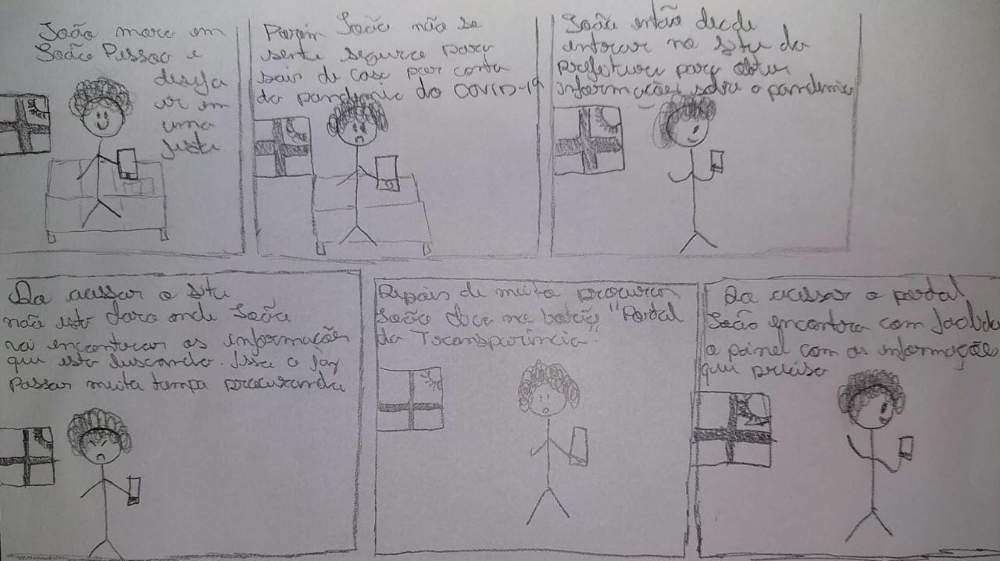
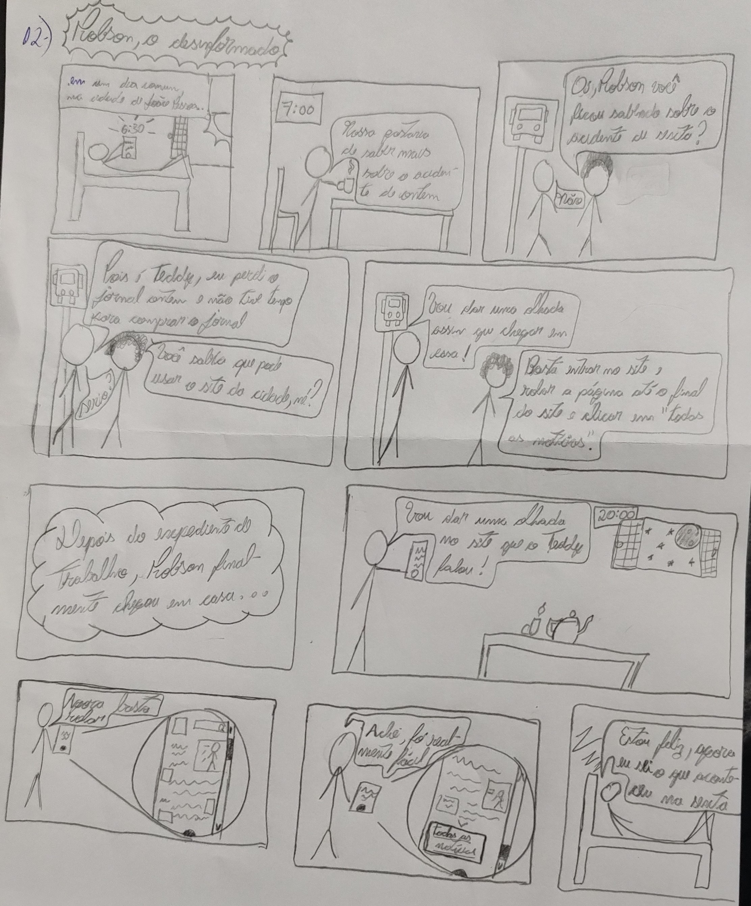

## 1.Introdução

&emsp;&emsp;O storyboard é um tipo de prototipação de baixa fidelidade que consiste em uma  sequencia de desenhos que se assemelham a uma história em quadrinhos. Seu objetivo é obter uma visualização de uma ação do usuário do sistema ao realizar determinada tarefa apresentando elementos como cenrário, pessoas envolvidas, as interações que podem ocorrer e os passos necessários para realizar a tarefa.

&emsp;&emsp;Este documento tem como objetivo apresentar os resultados obtidos a partir dos storyboards.

## 2. Metodologia

&emsp;&emsp; 
Utilizamos o <a href="https://interacao-humano-computador.github.io/2022.1-Prefeitura_Joao_Pessoa/AnaliseDeRequisitos/analiseDasTarefas.html">Documento de Análise de Tarefas</a> como base para a confecção dos stotyboards, pois lá estão detalhadas as tarefas que os usuários realizam no sistema. Após a escolha das tarefas, analisamos os cenários, as pessoas envolvidas, os passos a para a realizão e a motivação para cada uma das terefas. 
Os stooryboard foram desenhados à mão.

&emsp;&emsp; 
Os storyboards apresentados possuem como foco a verificação da facilidade do usuário ao realizar as tarefas proposta.

&emsp;&emsp; 
No primeiro storyboard percebemos a dificuldade do usuário em realizar a tarefa proposta, mostrando que o site da prefeitura de João Pessoa não está de acordo com as metas de usabilidade.

&emsp;&emsp; 
No segundo storyboard é abordado como é feito o acesso ao site para ler todas as notícias publicadas, mesmo que seja uma tarefa simples, a equipe crê que possam ter etapas que podem ser cortadas para tornar o acesso mais direto e com menos intereções.

## 3. Resultados

  

<figcaption align='center'>
  <h5>  <b>Storyboard 1: tarefa - acessar informações sobre a pandemia do covid-19 </b>  </h5>
  <small>Fonte: autor</small>
</figcaption>

  

<figcaption align='center'>
  <h5>  <b>Storyboard 2: tarefa - acessar as principais notícias </b>  </h5>
  <small>Fonte: autor</small>
</figcaption>

## 4. Conclusão

&emsp;&emsp;É possível afirmar que o storyboard é uma ferramenta muito útil para exemplificar como as tarefas do sistema podem ser realizadas, quais necessidades ele atende, a quem se destina, e quais motivações levam o usuário a utilizá-la, dessa forma, com base nos resultados apresentados, espera-se que os designers desenvolvam uma interface que possibilite melhor interação do usuário com o sistema.

## Bibliografia

BARBOSA, Simone; DINIZ, Bruno. Interação Humano-Computador, Editora Elsevier, Rio de Janeiro, 2010.

## Versionamento

| Data  | Versão |          Descrição           |                                               Autor                                                |
|:-----:|:------:|:----------------------------:|:--------------------------------------------------------------------------------------------------:|
| 06/08 |   v0   |      Criação do documento       |      [Gabrielly](https://github.com/GabriellyAssuncao)     |
| 07/08 |   v0.1   |      Revisão do documento       |      [Renann](https://github.com/NyndoND)     |
